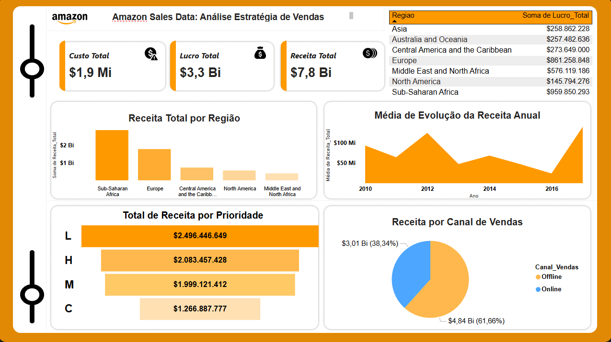

## Descrição do Projeto
Este dashboard foi desenvolvido para análise estratégica de vendas da Amazon, utilizando dados de vendas por região, canal de vendas e prioridade de pedidos. O objetivo é fornecer uma visão clara sobre receita, lucro e evolução anual das vendas, permitindo tomadas de decisão mais assertivas.

### Métricas Principais
- **Custo Total:** $1,9 Mi
- **Lucro Total:** $3,3 Bi
- **Receita Total:** $7,8 Bi

### Análises Incluídas
1. **Receita Total por Região:** Visualização das regiões com maior receita, destacando Sub-Saharan Africa e Europe.
2. **Média de Evolução da Receita Anual:** Análise de crescimento das vendas ao longo dos anos.
3. **Total de Receita por Prioridade:** Comparação da receita gerada por diferentes prioridades de pedidos (L, H, M, C).
4. **Receita por Canal de Vendas:** Distribuição da receita entre vendas **Offline** e **Online**.

### Tecnologias Utilizadas
- Power BI (para criação do dashboard)
- Python (Limpeza, tratamento e exoloração dos dados)
- Figma (parte visual do meu dashboard)
- Kaggle (para pegar a base de dados) 

### Objetivo do Projeto
O dashboard permite identificar regiões estratégicas, otimizar canais de vendas e priorizar ações que aumentem o lucro total da Amazon, apoiando decisões de negócios baseadas em dados reais.

---

> ⚠️ Observação: Todos os valores são fictícios e utilizados apenas para fins de análise visual e prática de dashboard.

# Amazon Sales Dashboard

